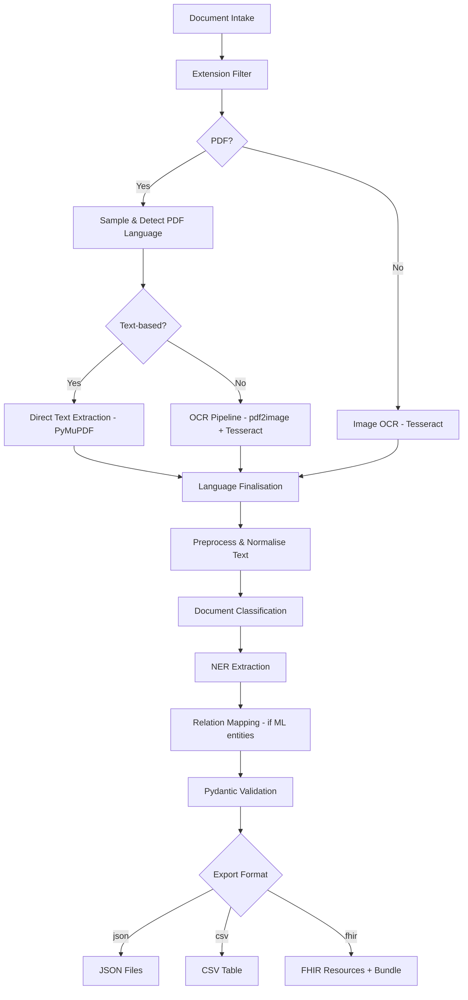

# DocIQ

DocIQ is an AI-powered medical document classification and extraction engine. It processes prescriptions, laboratory results, and clinical histories through OCR, language detection, rule-based NER, structured validation, and FHIR mapping to produce interoperable JSON artifacts.

## Table of Contents

- [Key Capabilities](#key-capabilities)
- [Pipeline Architecture](#pipeline-architecture)
- [Quick Start](#quick-start)
- [Installation](#installation)
- [Usage](#usage)
- [API Reference](#api-reference)
- [Docker](#docker)
- [Configuration](#configuration)
- [Testing](#testing)
- [Project Structure](#project-structure)
- [Troubleshooting](#troubleshooting)

## Key Capabilities

- **Mixed-mode PDF handling** -- auto-detects text-based vs scanned PDFs and selects direct extraction or OCR accordingly.
- **Bilingual language detection** -- samples PDF text with deterministic `langdetect` seeding to flag English and Spanish content for downstream routing.
- **Image preprocessing and OCR** -- normalises images with OpenCV binary thresholding before passing to Tesseract, improving quality on noisy scans.
- **Document classification** -- keyword-based scoring classifies documents as `prescription`, `result` (lab/imaging), or `clinical_history`.
- **Rule-based NER** -- purpose-built extractors pull structured fields (patient info, medications, test results, diagnoses) from each document type.
- **Pydantic validation** -- every extraction result is validated against a typed schema before export.
- **FHIR R4 mapping** -- validated entities convert to loose FHIR resources: `DiagnosticReport`, `MedicationRequest`, and `Encounter`.
- **Entity relation mapping** -- flat NER entity lists from ML models are automatically wired into structured relations via configurable anchor-dependent configs.
- **Multi-threaded batch processing** -- concurrent extraction and export with configurable worker pools.
- **Three export formats** -- JSON (one file per document), CSV (flat table), and FHIR (individual resources plus a Bundle).
- **Production-ready deployment** -- Dockerfile, Compose overlays, Nginx reverse proxy, health/readiness probes, structured JSON logging.

## Pipeline Architecture



Each stage records timing metrics to a thread-safe collector. The engine catches errors per-file so a single failure never blocks the rest of a batch.

## Quick Start

```bash
# 1. Clone and install
git clone <repo-url> && cd HealthParse
python -m venv .venv && source .venv/bin/activate
pip install -r requirements.txt

# 2. Process documents via CLI
python -m src.cli --input data/generated --output-dir output --format json

# 3. Or start the API server
uvicorn src.api.app:app --reload
# Then open http://localhost:8000/docs for Swagger UI

# 4. Or use Docker
docker compose up
```

## Installation

### Python environment

Requires Python 3.10+.

```bash
python -m venv .venv
source .venv/bin/activate        # Windows: .venv\Scripts\activate
pip install -r requirements.txt  # production deps
pip install -r requirements-dev.txt  # adds pytest + httpx
```

### System dependencies

DocIQ requires two external binaries that are not installable via pip:

**Tesseract OCR** (with English and Spanish language packs):

```bash
# Linux
sudo apt-get install tesseract-ocr tesseract-ocr-eng tesseract-ocr-spa

# macOS
brew install tesseract

# Windows -- download installer from https://github.com/UB-Mannheim/tesseract/wiki
# and add the install directory to PATH
```

**Poppler** (provides `pdftoppm` for pdf2image):

```bash
# Linux
sudo apt-get install poppler-utils

# macOS
brew install poppler

# Windows -- download from https://github.com/oschwartz10612/poppler-windows/releases
# and add the bin/ directory to PATH
```

Verify both are available:

```bash
tesseract --version
pdftoppm -h
```

## Usage

### CLI

```bash
# Process a folder, export as JSON (default)
python -m src.cli --input data/generated --output-dir output

# Export as FHIR resources
python -m src.cli --input data/generated --output-dir output --format fhir

# Export as CSV
python -m src.cli --input data/generated --output-dir output --format csv

# Process a single file
python -m src.cli --input data/generated/prescription_1.pdf --output-dir output

# Skip inference (extraction only)
python -m src.cli --input data/generated --output-dir output --no-inference

# Use a YAML config file
python -m src.cli --config dociq.yaml

# Verbose logging
python -m src.cli --input data/generated --output-dir output --log-level DEBUG
```

### Python API

```python
from src.pipeline.core_engine import DocIQEngine

engine = DocIQEngine()

# Single file
result = engine.process_file("data/generated/prescription_1.pdf")
print(result["document_type"])       # "prescription"
print(result["extracted_data"])      # validated dict
print(result["validated"])           # True

# Batch processing
batch = engine.process_batch("data/generated")
print(batch.summary())              # {"ok": 10}
print(len(batch.ok))                # successfully processed
print(len(batch.errors))            # failures

# Export
engine.export(batch, output_dir="output", fmt="json")
engine.export(batch, output_dir="output", fmt="fhir")
engine.export(batch, output_dir="output", fmt="csv")
```

### Lower-level access

```python
from src.pipeline.inference import create_default_engine

engine = create_default_engine()

# Classify text
doc_type = engine.classify(raw_text)  # "prescription" | "result" | "clinical_history" | None

# Full inference pipeline
result = engine.process_document("prescription", raw_text)
print(result.validated_data)          # Pydantic model
print(result.as_dict())               # plain dict

# FHIR mapping
from src.pipeline.fhir_mapper import map_to_fhir_loose
from src.pipeline.validation import Prescription

model = Prescription(**result.as_dict())
fhir = map_to_fhir_loose(model)       # {"resourceType": "MedicationRequest", ...}
```

## API Reference

Start the server with `uvicorn src.api.app:app --reload` and visit `/docs` for interactive Swagger UI or `/redoc` for ReDoc.

### Endpoints

**GET /health** -- Liveness probe. Returns status, version, uptime, and UTC timestamp.

**GET /ready** -- Readiness probe. Checks Tesseract, Poppler, inference engine, config, and disk space. Returns 200 when all pass, 503 otherwise. Compatible with Kubernetes readiness probes.

**POST /process** -- Upload one or more PDF/image files for processing. Accepts `format` query parameter (`json` or `fhir`). Each file goes through extraction, classification, NER, and validation. Returns a list of results with structured `extracted_data`.

```bash
# Upload a PDF for processing
curl -X POST http://localhost:8000/process \
  -F "files=@prescription.pdf"

# Request FHIR format
curl -X POST "http://localhost:8000/process?format=fhir" \
  -F "files=@lab_result.pdf"
```

## Docker

### Development

```bash
# Start the API server
docker compose up

# Run CLI processing
docker compose --profile cli run --rm cli

# Run tests
docker compose --profile dev run --rm test
```

The API service maps port 8000, mounts `./output` for results and `./data` as read-only input.

### Production

```bash
# One-command deploy with Nginx, health checks, and resource limits
./deploy/deploy.sh

# Or manually
docker compose -f docker-compose.yml -f docker-compose.prod.yml up -d --build
```

The production overlay adds Nginx as a reverse proxy with rate limiting (30 req/s general, 10 req/s for `/process`), security headers (X-Content-Type-Options, X-Frame-Options, CSP, Referrer-Policy), TLS template, resource limits (2 CPU / 2 GB), and log rotation.

Deploy script commands:

```bash
./deploy/deploy.sh                # Build and start
./deploy/deploy.sh --build        # Force rebuild
./deploy/deploy.sh --down         # Stop and remove
./deploy/deploy.sh --status       # Show status + health check
./deploy/deploy.sh --logs         # Tail logs
```

### Image details

The Dockerfile uses a multi-stage build (builder for wheel compilation, runtime with Python 3.11-slim) and installs Tesseract, Poppler, and OpenCV system dependencies. The final image includes a `HEALTHCHECK` that curls `/health` every 30 seconds.

## Configuration

DocIQ resolves settings from multiple sources in this priority order (highest wins):

1. Constructor kwargs or CLI flags
2. Environment variables prefixed with `DOCIQ_`
3. `.env` file in the project root
4. YAML config file (via `--config` or `DOCIQ_CONFIG_PATH`)
5. Built-in defaults

### Key settings

| Setting | Env var | Default | Description |
|---|---|---|---|
| `log_level` | `DOCIQ_LOG_LEVEL` | `INFO` | DEBUG, INFO, WARNING, ERROR |
| `log_format` | `DOCIQ_LOG_FORMAT` | `text` | `text` or `json` (structured) |
| `input_dir` | `DOCIQ_INPUT_DIR` | -- | Input file or directory path |
| `output_dir` | `DOCIQ_OUTPUT_DIR` | `output` | Export destination |
| `export_format` | `DOCIQ_EXPORT_FORMAT` | `json` | `json`, `csv`, or `fhir` |
| `run_inference` | `DOCIQ_RUN_INFERENCE` | `true` | Enable classification + NER |
| `ocr_dpi` | `DOCIQ_OCR_DPI` | `300` | DPI for PDF-to-image conversion |
| `ocr_lang` | `DOCIQ_OCR_LANG` | `eng+spa` | Tesseract language packs |
| `max_workers` | `DOCIQ_MAX_WORKERS` | auto | Thread pool size |
| `page_timeout` | `DOCIQ_PAGE_TIMEOUT` | `300` | Per-page timeout in seconds |
| `preprocessing_threshold` | `DOCIQ_PREPROCESSING_THRESHOLD` | `120` | Binary threshold (0-255) |
| `fhir_bundle` | `DOCIQ_FHIR_BUNDLE` | `true` | Generate FHIR Bundle |
| `api_host` | `DOCIQ_API_HOST` | `0.0.0.0` | FastAPI bind address |
| `api_port` | `DOCIQ_API_PORT` | `8000` | FastAPI port |
| `api_workers` | `DOCIQ_API_WORKERS` | `1` | Uvicorn worker count |
| `tesseract_cmd` | `DOCIQ_TESSERACT_CMD` | -- | Custom Tesseract binary path |
| `poppler_path` | `DOCIQ_POPPLER_PATH` | -- | Custom Poppler bin directory |

### YAML config example

```yaml
input_dir: data/generated
output_dir: output
export_format: fhir
log_level: DEBUG
ocr_dpi: 300
max_workers: 4
run_inference: true
fhir_bundle: true
```

## Testing

```bash
# Run the full suite
pytest

# Run with verbose output
pytest -v --tb=short

# Run a specific test module
pytest tests/test_integration.py -v

# Run tests in Docker
docker compose --profile dev run --rm test
```

The test suite contains 1100+ tests covering extraction, classification, NER, validation, FHIR mapping, export, API endpoints, containerisation, deployment, architecture, and full pipeline integration. Tests mock file I/O but use the real inference engine for realistic coverage.

## Project Structure

```
.
├── src/
│   ├── __init__.py                  # Package exports
│   ├── cli.py                       # CLI entry point (argparse)
│   ├── main.py                      # Main entry point
│   ├── config.py                    # Settings loader (env/yaml/defaults)
│   ├── logging_config.py            # Text and JSON log formatters
│   ├── data_generator.py            # Synthetic test data generation
│   ├── api/
│   │   ├── app.py                   # FastAPI application
│   │   └── models.py               # Request/response Pydantic models
│   └── pipeline/
│       ├── core_engine.py           # DocIQEngine orchestrator
│       ├── inference.py             # InferenceEngine, ModelBundle, ModelRegistry
│       ├── process_folder.py        # Batch file ingestion with threading
│       ├── pdf_extractor.py         # Direct text extraction + OCR for PDFs
│       ├── pdf_type_detector.py     # Text-based vs scanned PDF detection
│       ├── ocr.py                   # Image OCR via Tesseract
│       ├── language.py              # Language detection (langdetect)
│       ├── preprocess.py            # Image binarisation + text normalisation
│       ├── metrics.py               # Thread-safe timing and metrics
│       ├── output_formatter.py      # JSON/CSV/FHIR export
│       ├── output_collector.py      # Batch result aggregation
│       ├── fhir_mapper.py           # FHIR R4 resource mapping
│       ├── fhir_output_saver.py     # FHIR file persistence
│       ├── relation_mapper.py       # Entity relation wiring
│       ├── relation_configs.py      # Domain-specific relation configs
│       ├── model_manager.py         # Model persistence and loading
│       ├── train_ner.py             # NER model training
│       ├── exceptions.py            # Custom exception hierarchy
│       ├── extractors/
│       │   ├── base.py              # Shared helpers (extract_field, extract_date, ...)
│       │   ├── field_aliases.py     # Shared field-name fallback resolvers
│       │   ├── document_classifier.py  # Keyword-based document classification
│       │   ├── prescription_extractor.py
│       │   ├── result_extractor.py
│       │   └── clinical_history_extractor.py
│       ├── validation/
│       │   ├── schemas.py           # ResultSchema (lab/imaging)
│       │   ├── prescription_schema.py
│       │   ├── clinical_history_schema.py
│       │   └── validator.py         # validate_* functions, SCHEMA_REGISTRY
│       └── utils/
│           ├── date_utils.py        # Date parsing and normalisation
│           ├── text_utils.py        # Unicode cleanup, whitespace collapsing
│           └── language.py          # Language utility wrappers
├── tests/                           # 1100+ pytest tests
├── deploy/
│   ├── deploy.sh                    # Production deployment script
│   ├── .env.production              # Production environment template
│   └── nginx/
│       └── nginx.conf               # Nginx reverse proxy config
├── Dockerfile                       # Multi-stage container build
├── docker-compose.yml               # Dev services (api, cli, test)
├── docker-compose.prod.yml          # Production overlay (nginx, limits)
├── .dockerignore
├── requirements.txt                 # Production Python dependencies
└── requirements-dev.txt             # Dev dependencies (pytest, httpx)
```

## Troubleshooting

**`fitz` import errors** -- Ensure PyMuPDF installed successfully. Reinstall with `pip install --upgrade pymupdf`.

**`pdf2image` cannot find Poppler** -- Add the Poppler binary directory to your `PATH`. On Windows, download Poppler for Windows and set the `DOCIQ_POPPLER_PATH` environment variable to point to the `bin/` folder.

**OCR output is noisy** -- Confirm Tesseract is installed with the appropriate language packs (`tesseract --list-langs`). Adjust the binarisation threshold via `DOCIQ_PREPROCESSING_THRESHOLD` (default 120, lower values produce more white).

**API returns 503 on /ready** -- The readiness probe checks Tesseract, Poppler, disk space (>100 MB), config loading, and inference engine initialisation. Check `detail` in each failing check's response to identify the issue.

**Classification returns "unknown"** -- The classifier uses keyword scoring with a configurable minimum threshold. If your documents use non-standard headings, the classifier may not match. Check the document text and ensure it contains recognisable medical keywords.

**Docker build fails on system deps** -- The Dockerfile installs `tesseract-ocr`, `poppler-utils`, and OpenCV system libraries. If building behind a corporate proxy, set `http_proxy`/`https_proxy` build args.
