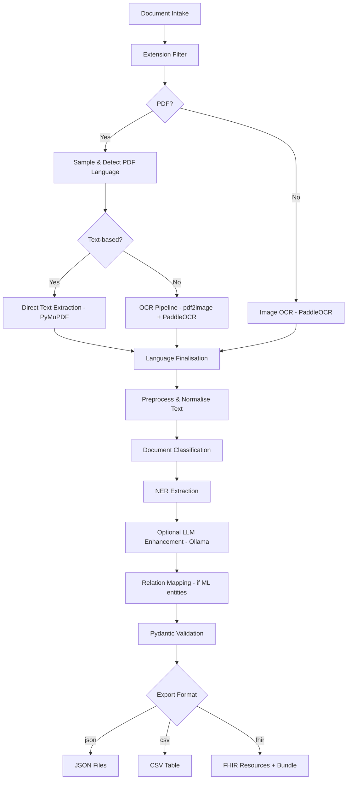

# DocIQ

DocIQ is an AI-powered medical document classification and extraction engine. It processes prescriptions, laboratory results, clinical histories, and pharmacy receipts through OCR (PaddleOCR PP-OCRv6), language detection, rule-based NER, an optional local-LLM enhancement layer, structured validation, and FHIR mapping to produce interoperable JSON artifacts. Everything runs locally: no cloud APIs, no data leaves the machine.

## Table of Contents

- [Key Capabilities](#key-capabilities)
- [Pipeline Architecture](#pipeline-architecture)
- [Quick Start](#quick-start)
- [Installation](#installation)
- [Usage](#usage)
- [API Reference](#api-reference)
- [Docker](#docker)
- [Configuration](#configuration)
- [OCR Engine Benchmark](#ocr-engine-benchmark)
- [Testing](#testing)
- [Project Structure](#project-structure)
- [Troubleshooting](#troubleshooting)

## Key Capabilities

- **Mixed-mode PDF handling** -- auto-detects text-based vs scanned PDFs and selects direct extraction or OCR accordingly.
- **Bilingual language detection** -- samples PDF text with deterministic `langdetect` seeding to flag English and Spanish content for downstream routing.
- **Multilingual OCR (PaddleOCR PP-OCRv6)** -- single model covering 50 languages including Spanish with native accent support. Engine tier is configurable (`pp-ocrv6_tiny` default, `pp-ocrv6_small` for higher accuracy, `pp-ocrv4` legacy fallback); selection validated by a 584-document benchmark (see [OCR Engine Benchmark](#ocr-engine-benchmark)).
- **Document classification** -- keyword-based scoring classifies documents as `prescription`, `result` (lab/imaging), `clinical_history`, or `receipt`.
- **Rule-based NER** -- purpose-built extractors pull structured fields (patient info, medications, test results, diagnoses, receipt line items) from each document type, with accent-flexible field matching for OCR'd Spanish text.
- **Optional LLM enhancement** -- when enabled, raw text is sent to a local Ollama model after rule-based extraction and the results are merged field-by-field, preferring the richer value. Disabled by default; the pipeline is fully functional without it.
- **Pydantic validation** -- extraction results are validated against typed schemas before export. Documents classified to a type with no registered extractor return an explicit `unsupported_document_type` status instead of failing silently.
- **FHIR R4 mapping** -- validated entities convert to loose FHIR resources: `DiagnosticReport`, `MedicationRequest`, and `Encounter`.
- **Entity relation mapping** -- flat NER entity lists from ML models are automatically wired into structured relations via configurable anchor-dependent configs.
- **Multi-threaded batch processing** -- concurrent extraction and export with configurable worker pools; the API processes concurrent uploads without blocking the event loop (`asyncio.to_thread`).
- **Three export formats** -- JSON (one file per document), CSV (flat table), and FHIR (individual resources plus a Bundle).
- **Reproducible OCR benchmark suite** -- dataset builder, seeded degradation generator, and metrics harness under `scripts/`, with per-file results in `benchmarks/results/`.
- **Production-ready deployment** -- Dockerfile, Compose overlays, Nginx reverse proxy, health/readiness probes, structured JSON logging.

## Pipeline Architecture


```mermaid
graph TD
    A[Document Intake] --> B[Extension Filter]
    B --> C{PDF?}
    C -- Yes --> D[Sample & Detect PDF Language]
    D --> E{Text-based?}
    E -- Yes --> F[Direct Text Extraction - PyMuPDF]
    E -- No --> G[OCR Pipeline - pdf2image + PaddleOCR]
    F --> H[Language Finalisation]
    G --> H
    C -- No --> I[Image OCR - PaddleOCR]
    I --> H
    H --> J[Preprocess & Normalise Text]
    J --> K[Document Classification]
    K --> L[NER Extraction]
    L --> M[Optional LLM Enhancement - Ollama]
    M --> N[Relation Mapping - if ML entities]
    N --> O[Pydantic Validation]
    O --> P{Export Format}
    P -- json --> Q[JSON Files]
    P -- csv --> R[CSV Table]
    P -- fhir --> S[FHIR Resources + Bundle]
```

Each stage records timing metrics to a thread-safe collector. The engine catches errors per-file so a single failure never blocks the rest of a batch. Multi-page PDFs are split and each page is classified and extracted independently.

## Quick Start

```bash
# 1. Clone and install
git clone https://github.com/pierremontanov/DocIQ.git && cd DocIQ
python -m venv .venv && source .venv/bin/activate
pip install -r requirements.txt

# 2. Pre-download OCR model weights (optional -- otherwise they download on first use)
python -m src.pipeline.ocr_paddle --download

# 3. Process documents via CLI
python -m src.cli --input data/generated --output-dir output --format json

# 4. Or start the API server
uvicorn src.api.app:app --reload
# Then open http://localhost:8000/docs for Swagger UI

# 5. Or use Docker
docker compose up
```

## Installation

### Python environment

Requires Python 3.10+.

```bash
python -m venv .venv
source .venv/bin/activate        # Windows: .venv\Scripts\activate
pip install -r requirements.txt  # production deps (includes paddlepaddle + paddleocr>=3.6)
pip install -r requirements-dev.txt  # adds pytest + httpx
```

### System dependencies

**Poppler** (provides `pdftoppm` for pdf2image) is the only external binary required:

```bash
# Linux
sudo apt-get install poppler-utils

# macOS
brew install poppler

# Windows -- download from https://github.com/oschwartz10612/poppler-windows/releases
# and either add the bin/ directory to PATH, set DOCIQ_POPPLER_PATH, or drop the
# extracted "poppler" folder into the repo root (auto-detected at startup).
```

**OCR models** download automatically on first use (internet required once) and are cached under `~/.paddlex/official_models/`. Pre-fetch them for Docker builds or air-gapped deployments:

```bash
python -m src.pipeline.ocr_paddle --download
```

Tesseract is **no longer required** -- the OCR stage migrated to PaddleOCR.

Verify:

```bash
pdftoppm -h
python -m src.pipeline.ocr_paddle --test path/to/scan.png
```

### Optional: local LLM enhancement

The LLM layer is off by default. To enable it, run an [Ollama](https://ollama.com) server (locally or on your LAN), then set:

```bash
export DOCIQ_LLM_ENABLED=true
export DOCIQ_LLM_ENDPOINT=http://localhost:11434
export DOCIQ_LLM_MODEL=dociq-medical
```

If the server is unreachable the pipeline logs a notice and falls back to rule-based results -- LLM failures never break processing.

## Usage

### CLI

```bash
# Process a folder, export as JSON (default)
python -m src.cli --input data/generated --output-dir output

# Export as FHIR resources
python -m src.cli --input data/generated --output-dir output --format fhir

# Export as CSV
python -m src.cli --input data/generated --output-dir output --format csv

# Process a single file
python -m src.cli --input data/generated/prescription_1.pdf --output-dir output

# Skip inference (extraction only)
python -m src.cli --input data/generated --output-dir output --no-inference

# Use a YAML config file
python -m src.cli --config dociq.yaml

# Cap the worker pool / verbose logging
python -m src.cli --input data/generated --output-dir output --max-workers 4 --log-level DEBUG
```

### Python API

```python
from src.pipeline.core_engine import DocIQEngine

engine = DocIQEngine()

# Single file
result = engine.process_file("data/generated/prescription_1.pdf")
print(result["document_type"])       # "prescription"
print(result["extracted_data"])      # validated dict
print(result["validated"])           # True

# Multi-page PDFs additionally return per-page results
result = engine.process_file("bundle.pdf")
print(result.get("page_count"))      # e.g. 3
print(result.get("pages"))           # per-page classification + extraction

# Batch processing
batch = engine.process_batch("data/generated")
print(batch.summary())              # {"ok": 10}
print(len(batch.ok))                # successfully processed
print(len(batch.errors))            # failures

# Export
engine.export(batch, output_dir="output", fmt="json")
engine.export(batch, output_dir="output", fmt="fhir")
engine.export(batch, output_dir="output", fmt="csv")
```

### Lower-level access

```python
from src.pipeline.inference import create_default_engine

engine = create_default_engine()

# Classify text
doc_type = engine.classify(raw_text)  # "prescription" | "result" | "clinical_history" | "receipt" | None

# Full inference pipeline
result = engine.process_document("prescription", raw_text)
print(result.validated_data)          # Pydantic model
print(result.as_dict())               # plain dict
print(result.llm_fields_used)         # fields enhanced by the LLM (None when disabled)

# FHIR mapping
from src.pipeline.fhir_mapper import map_to_fhir_loose
from src.pipeline.validation import Prescription

model = Prescription(**result.as_dict())
fhir = map_to_fhir_loose(model)       # {"resourceType": "MedicationRequest", ...}
```

## API Reference

Start the server with `uvicorn src.api.app:app --reload` and visit `/docs` for interactive Swagger UI or `/redoc` for ReDoc.

### Endpoints

**GET /health** -- Liveness probe. Returns status, version, uptime, and UTC timestamp.

**GET /ready** -- Readiness probe. Checks the PaddleOCR engine (warm-up), Poppler, inference engine, config, and disk space. Returns 200 when all pass, 503 otherwise. Compatible with Kubernetes readiness probes.

**POST /process** -- Upload one or more PDF/image files for processing. Accepts `format` query parameter (`json` or `fhir`). Files are validated, written to temp storage, then processed concurrently off the event loop. Returns a list of results with structured `extracted_data`.

```bash
# Upload a PDF for processing
curl -X POST http://localhost:8000/process \
  -F "files=@prescription.pdf"

# Request FHIR format
curl -X POST "http://localhost:8000/process?format=fhir" \
  -F "files=@lab_result.pdf"
```

## Docker

### Development

```bash
# Start the API server
docker compose up

# Run CLI processing
docker compose --profile cli run --rm cli

# Run tests
docker compose --profile dev run --rm test
```

The API service maps port 8000, mounts `./output` for results and `./data` as read-only input.

### Production

```bash
# One-command deploy with Nginx, health checks, and resource limits
./deploy/deploy.sh

# Or manually
docker compose -f docker-compose.yml -f docker-compose.prod.yml up -d --build
```

The production overlay adds Nginx as a reverse proxy with rate limiting (30 req/s general, 10 req/s for `/process`), security headers (X-Content-Type-Options, X-Frame-Options, CSP, Referrer-Policy), TLS template, resource limits, and log rotation.

Deploy script commands:

```bash
./deploy/deploy.sh                # Build and start
./deploy/deploy.sh --build        # Force rebuild
./deploy/deploy.sh --down         # Stop and remove
./deploy/deploy.sh --status      # Show status + health check
./deploy/deploy.sh --logs        # Tail logs
```

### Image details

The Dockerfile uses a multi-stage build (builder for wheel compilation, runtime with Python slim) and installs Poppler and OpenCV system libraries. PaddleOCR model weights are pre-fetched at build time so containers start without downloading. The final image includes a `HEALTHCHECK` that curls `/health` every 30 seconds.

## Configuration

DocIQ resolves settings from multiple sources in this priority order (highest wins):

1. Constructor kwargs or CLI flags
2. Environment variables prefixed with `DOCIQ_`
3. `.env` file in the project root
4. YAML config file (via `--config` or `DOCIQ_CONFIG_PATH`)
5. Built-in defaults

### Key settings

| Setting | Env var | Default | Description |
|---|---|---|---|
| `log_level` | `DOCIQ_LOG_LEVEL` | `INFO` | DEBUG, INFO, WARNING, ERROR |
| `log_format` | `DOCIQ_LOG_FORMAT` | `text` | `text` or `json` (structured) |
| `input_dir` | `DOCIQ_INPUT_DIR` | -- | Input file or directory path |
| `output_dir` | `DOCIQ_OUTPUT_DIR` | `output` | Export destination |
| `export_format` | `DOCIQ_EXPORT_FORMAT` | `json` | `json`, `csv`, or `fhir` |
| `run_inference` | `DOCIQ_RUN_INFERENCE` | `true` | Enable classification + NER |
| `ocr_model` | `DOCIQ_OCR_MODEL` | `pp-ocrv6_tiny` | OCR engine tier: `pp-ocrv6_tiny`, `pp-ocrv6_small`, `pp-ocrv6_medium`, or legacy `pp-ocrv4` |
| `ocr_det_model` | `DOCIQ_OCR_DET_MODEL` | auto | Explicit detection-model override (rarely needed) |
| `ocr_dpi` | `DOCIQ_OCR_DPI` | `300` | DPI for PDF-to-image conversion |
| `llm_enabled` | `DOCIQ_LLM_ENABLED` | `false` | Enable the LLM enhancement layer |
| `llm_endpoint` | `DOCIQ_LLM_ENDPOINT` | local Ollama | Base URL of the Ollama API server |
| `llm_model` | `DOCIQ_LLM_MODEL` | `dociq-medical` | Ollama model for classification/extraction |
| `llm_timeout` | `DOCIQ_LLM_TIMEOUT` | `120` | Seconds per LLM request |
| `llm_retries` | `DOCIQ_LLM_RETRIES` | `1` | Retry attempts before falling back |
| `llm_keep_alive` | `DOCIQ_LLM_KEEP_ALIVE` | `30m` | How long Ollama keeps the model in VRAM |
| `llm_context_chars` | `DOCIQ_LLM_CONTEXT_CHARS` | `3000` | Max characters sent to the LLM per request (500-32000) |
| `max_workers` | `DOCIQ_MAX_WORKERS` | auto | Thread pool size |
| `page_timeout` | `DOCIQ_PAGE_TIMEOUT` | `300` | Per-page timeout in seconds |
| `model_path` | `DOCIQ_MODEL_PATH` | -- | Trained model artefact for the inference engine |
| `fhir_bundle` | `DOCIQ_FHIR_BUNDLE` | `true` | Generate FHIR Bundle |
| `api_host` | `DOCIQ_API_HOST` | `0.0.0.0` | FastAPI bind address |
| `api_port` | `DOCIQ_API_PORT` | `8000` | FastAPI port |
| `api_workers` | `DOCIQ_API_WORKERS` | `1` | Uvicorn worker count |
| `poppler_path` | `DOCIQ_POPPLER_PATH` | auto | Custom Poppler bin directory (a bundled `poppler/` folder in the repo root is auto-detected) |

### YAML config example

```yaml
input_dir: data/generated
output_dir: output
export_format: fhir
log_level: DEBUG
ocr_model: pp-ocrv6_small
max_workers: 4
run_inference: true
fhir_bundle: true
```

## OCR Engine Benchmark

The PP-OCRv6 migration was decided by a pre-registered benchmark over 584 documents in three tiers: 90 clean synthetic renders (45 EN / 45 ES), 450 seeded degradations (rotation, noise, JPEG-40, low resolution, blur), and 44 real scanned Spanish medical documents with hand-corrected ground truth. Headline medians:

| Metric | PP-OCRv4 | v6_tiny (default) | v6_small |
|---|---|---|---|
| CER, degraded documents | 6.8% | 2.7% | 1.9% |
| CER, real documents | 43.2% | 30.1% | 25.7% |
| Spanish accent accuracy | 0.00 | 0.90-1.00 | 1.00 |
| Latency per real document (CPU) | 59 s | 16 s | 31 s |

Full methodology, figures, and limitations are in `DocIQ_OCR_Benchmark_Report.docx`; per-file results live in `benchmarks/results/`.

The synthetic tiers are fully reproducible (the builders are deterministic and seeded):

```bash
python scripts/build_benchmark.py
python scripts/degrade_images.py
python scripts/benchmark_ocr.py --run-name my_run --tiers clean degraded
```

The 44 real documents and their transcriptions are withheld from the repository for patient privacy; real-tier results are reported in the benchmark report but reproducing them requires a private document set.

## Testing

```bash
# Run the full suite
pytest

# Run with verbose output
pytest -v --tb=short

# Run a specific test module
pytest tests/test_integration.py -v

# Run tests in Docker
docker compose --profile dev run --rm test
```

The test suite contains 1100+ tests covering extraction, classification, NER, validation, FHIR mapping, export, API endpoints, containerisation, deployment, architecture, and full pipeline integration. Tests mock file I/O but use the real inference engine for realistic coverage. Note: `tests/test_ocr.py` and `tests/test_ocr_comprehensive.py` still target the retired Tesseract module and are pending a rewrite against `ocr_paddle`.

## Project Structure

```
.
├── src/
│   ├── __init__.py                  # Package exports
│   ├── cli.py                       # CLI entry point (argparse)
│   ├── main.py                      # Main entry point
│   ├── config.py                    # Settings loader (env/yaml/defaults)
│   ├── logging_config.py            # Text and JSON log formatters
│   ├── data_generator.py            # Synthetic test data generation
│   ├── api/
│   │   ├── app.py                   # FastAPI application
│   │   └── models.py               # Request/response Pydantic models
│   └── pipeline/
│       ├── core_engine.py           # DocIQEngine orchestrator (page splitting, statuses)
│       ├── inference.py             # InferenceEngine, ModelBundle, LLM merge logic
│       ├── llm_client.py            # Ollama HTTP client (retries, JSON parsing)
│       ├── process_folder.py        # Batch file ingestion with threading
│       ├── ocr_paddle.py            # PaddleOCR engine (PP-OCRv6/v4, singleton, warm-up, --download CLI)
│       ├── ocr.py                   # Legacy Tesseract module (retired; kept for reference)
│       ├── pdf_extractor.py         # Direct text extraction + OCR for PDFs
│       ├── pdf_type_detector.py     # Text-based vs scanned PDF detection
│       ├── language.py              # Language detection (langdetect)
│       ├── preprocess.py            # Text normalisation (PaddleOCR handles image prep internally)
│       ├── metrics.py               # Thread-safe timing and metrics
│       ├── output_formatter.py      # JSON/CSV/FHIR export
│       ├── output_collector.py      # Batch result aggregation
│       ├── fhir_mapper.py           # FHIR R4 resource mapping
│       ├── fhir_output_saver.py     # FHIR file persistence
│       ├── relation_mapper.py       # Entity relation wiring
│       ├── relation_configs.py      # Domain-specific relation configs
│       ├── model_manager.py         # Model persistence and loading
│       ├── train_ner.py             # NER model training
│       ├── exceptions.py            # Custom exception hierarchy
│       ├── extractors/
│       │   ├── base.py              # Shared helpers incl. accent-flexible matching
│       │   ├── field_aliases.py     # Shared field-name fallback resolvers
│       │   ├── document_classifier.py  # Keyword-based document classification
│       │   ├── prescription_extractor.py
│       │   ├── result_extractor.py
│       │   ├── clinical_history_extractor.py
│       │   └── receipt_extractor.py # Pharmacy/clinic receipts (EN + ES)
│       ├── validation/
│       │   ├── schemas.py           # ResultSchema (lab/imaging)
│       │   ├── prescription_schema.py
│       │   ├── clinical_history_schema.py
│       │   └── validator.py         # validate_* functions, SCHEMA_REGISTRY
│       └── utils/
│           ├── date_utils.py        # Date parsing and normalisation
│           ├── text_utils.py        # Unicode cleanup, whitespace collapsing
│           └── language.py          # Language utility wrappers
├── scripts/
│   ├── build_benchmark.py           # Benchmark dataset builder (synthetic tiers + manifest)
│   ├── degrade_images.py            # Seeded degradation generator
│   ├── benchmark_ocr.py             # Metrics harness (CER/WER, accents, latency, memory)
│   └── compare_ocr.py               # Ad-hoc engine comparison on single pages
├── benchmarks/
│   ├── results/                     # Per-file benchmark results (JSON + CSV per run)
│   └── figures/                     # Report charts (PNG)
├── data/
│   ├── generated/                   # Synthetic PDFs/PNGs from data_generator
│   └── benchmark/                   # Benchmark tiers, manifest, synthetic ground truth
├── tests/                           # 1100+ pytest tests
├── deploy/
│   ├── deploy.sh                    # Production deployment script
│   ├── .env.production              # Production environment template
│   └── nginx/
│       └── nginx.conf               # Nginx reverse proxy config
├── DocIQ_OCR_Benchmark_Report.docx  # Full benchmark lab report
├── Dockerfile                       # Multi-stage container build
├── docker-compose.yml               # Dev services (api, cli, test)
├── docker-compose.prod.yml          # Production overlay (nginx, limits)
├── requirements.txt                 # Production Python dependencies
└── requirements-dev.txt             # Dev dependencies (pytest, httpx)
```

## Troubleshooting

**`fitz` import errors** -- Ensure PyMuPDF installed successfully. Reinstall with `pip install --upgrade pymupdf`.

**`pdf2image` cannot find Poppler** -- Add the Poppler binary directory to your `PATH`, set `DOCIQ_POPPLER_PATH`, or place the extracted `poppler/` folder in the repo root (auto-detected).

**First OCR request is slow or fails offline** -- PaddleOCR downloads model weights on first use. Pre-fetch with `python -m src.pipeline.ocr_paddle --download` while online; weights are cached under `~/.paddlex/official_models/`.

**OCR output is poor on a specific document class** -- Try the higher-accuracy tier: `DOCIQ_OCR_MODEL=pp-ocrv6_small`. If behaviour changed after upgrading, the legacy engine remains available via `DOCIQ_OCR_MODEL=pp-ocrv4` (note: the v4 English model strips Spanish accents).

**API returns 503 on /ready** -- The readiness probe checks the PaddleOCR engine, Poppler, disk space (>100 MB), config loading, and inference engine initialisation. Check `detail` in each failing check's response to identify the issue.

**Classification returns "unknown" or `unsupported_document_type`** -- The classifier uses keyword scoring with a configurable minimum threshold; non-standard headings may not match. `unsupported_document_type` means the document was classified to a type with no registered extractor -- register one in `create_default_engine()` or handle the status downstream.

**LLM enhancement not applying** -- Confirm `DOCIQ_LLM_ENABLED=true` and that the Ollama endpoint responds (`curl <endpoint>`). The engine checks availability once per process and falls back to rule-based extraction silently; look for "LLM server not available" in the logs.

**Docker build fails on system deps** -- The Dockerfile installs `poppler-utils` and OpenCV system libraries. If building behind a corporate proxy, set `http_proxy`/`https_proxy` build args.
